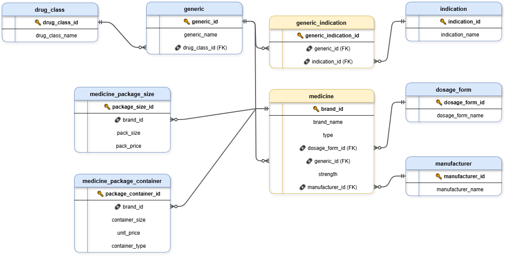

# PharmaMarket EDA


## Overview

This project explores a cleaned dataset of medicines sold in Bangladesh. It uses PostgreSQL to analyse market structure, manufacturer portfolios, generic competition, dosage forms, packaging, and prices.

The repository is the third stage of the PharmaMarket Data Platform:

1. [PharmaMarket_ETL](https://github.com/GabrielaY0rdanova/PharmaMarket_ETL) builds the relational SQL Server database.
2. [PharmaMarket_Cleaning](https://github.com/GabrielaY0rdanova/PharmaMarket_Cleaning) cleans and validates the source tables.
3. PharmaMarket_EDA migrates a snapshot to PostgreSQL and runs the analysis.
4. [PharmaMarket_Visualization](https://github.com/GabrielaY0rdanova/PharmaMarket_Visualization) presents selected findings in Tableau.

I used SQL Server for the ETL and cleaning stages, then PostgreSQL and VS Code for EDA. This shows the same relational model working across two database platforms.

## Analytical Scope

The SQL scripts answer these questions:

- Which drug classes, dosage forms, and manufacturers contain the most medicines?
- How many competing brands exist for each generic?
- How broad are manufacturer portfolios across generics and drug classes?
- How do pack and unit prices vary across product groups?
- Which medicines, manufacturers, and drug classes rank highest by selected measures?
- How can medicines, generics, and manufacturers be grouped into practical segments?

The reports retain missing relationships where they affect totals. For example, manufacturer and dosage-form shares include an `Unknown` group instead of silently excluding unmatched medicines.

## Dataset

The PostgreSQL snapshot contains nine related tables.

| Table | Rows |
|---|---:|
| `drug_class` | 422 |
| `dosage_form` | 113 |
| `manufacturer` | 240 |
| `indication` | 2,043 |
| `generic` | 1,711 |
| `medicine` | 21,708 |
| `medicine_package_size` | 14,349 |
| `medicine_package_container` | 22,707 |
| `generic_indication` | 1,608 |



The original data comes from the Kaggle dataset [Assorted Medicine Dataset of Bangladesh](https://www.kaggle.com/datasets/ahmedshahriarsakib/assorted-medicine-dataset-of-bangladesh).

## Project Structure

```text
PharmaMarket_EDA/
|-- docs/
|   `-- Pharma_ERD.png
|-- source_data/
|   `-- nine validated CSV snapshots
|-- scripts/
|   |-- 00_InitDatabase.sql
|   |-- 01_ExportSourceData.py
|   |-- 02_LoadSourceData.sql
|   |-- 03_DatabaseExploration.sql
|   |-- 04_DimensionsExploration.sql
|   |-- 05_MeasuresExploration.sql
|   |-- 06_MagnitudeAnalysis.sql
|   |-- 07_RankingAnalysis.sql
|   |-- 08_PartToWholeAnalysis.sql
|   |-- 09_DataSegmentation.sql
|   |-- 10_ReportGenerics.sql
|   |-- 11_ReportMedicines.sql
|   `-- 12_ReportManufacturers.sql
|-- tests/
|   |-- 13_ValidationGate.sql
|   `-- test_eda_contract.py
|-- run_full_eda.sql
|-- run_all_analysis.sql
|-- run_validation.sql
`-- README.md
```

## Reproducible Workflow

### 1. Optional SQL Server export

The committed files in `source_data/` are ready to load. Export a new snapshot only when the cleaned SQL Server database changes.

The exporter reads these optional environment variables:

| Variable | Default |
|---|---|
| `PHARMAMARKET_SQL_SERVER` | `DESKTOP-SJC0GQV\SQLEXPRESS` |
| `PHARMAMARKET_CLEAN_DATABASE` | `PharmaMarketAnalytics_Clean` |
| `PHARMAMARKET_ODBC_DRIVER` | `ODBC Driver 17 for SQL Server` |
| `PHARMAMARKET_EDA_SOURCE_DIR` | repository `source_data` directory |

Run:

```powershell
python scripts/01_ExportSourceData.py
```

### 2. Create a PostgreSQL test database

Create an empty database named `PharmaMarketAnalytics_EDA`. The schema script refuses to reset unrelated databases.

```powershell
& "D:\Programs\Data Analysis\PostgreSQL\bin\createdb.exe" -U postgres PharmaMarketAnalytics_EDA
```

### 3. Rebuild and validate

Run the psql workflow from the repository root. Use forward slashes in `source_data_dir`.

```powershell
& "D:\Programs\Data Analysis\PostgreSQL\bin\psql.exe" `
  -U postgres `
  -d PharmaMarketAnalytics_EDA `
  -v "source_data_dir=E:/Data Analysis/My Projects/PharmaMarket Data Platform/PharmaMarket_EDA/source_data" `
  -f "run_full_eda.sql"
```

The runner enables `ON_ERROR_STOP`, performs the reset and load in one transaction, and executes the validation gate before commit. A failure rolls back the rebuild.
It also sets the PostgreSQL client encoding to UTF-8 so medicine names with Unicode characters display correctly in Windows terminals.

To validate an existing database without rebuilding it:

```powershell
& "D:\Programs\Data Analysis\PostgreSQL\bin\psql.exe" `
  -U postgres `
  -d PharmaMarketAnalytics_EDA `
  -f "run_validation.sql"
```

### 4. Run the analysis

Open scripts `03` through `12` in VS Code with SQLTools and execute them against the validated EDA database. The scripts cover database profiling, dimensions, measures, magnitude, rankings, part-to-whole analysis, segmentation, and three reusable reports.

You can also verify every analysis script with one psql command:

```powershell
& "D:\Programs\Data Analysis\PostgreSQL\bin\psql.exe" `
  -U postgres `
  -d PharmaMarketAnalytics_EDA `
  -f "run_all_analysis.sql"
```

Run the static contract tests with:

```powershell
python -m unittest discover -s tests -p "test_*.py" -v
```

## Verified Findings

- The snapshot contains 21,708 medicines from 240 manufacturers.
- It covers 1,711 generics, 422 drug classes, and 113 dosage forms.
- Pack prices range from 10.20 to 278,400.00, with an average of 840.73.
- Unit prices reach 8,976.66, with an average of 69.79.
- No generic has more than one linked indication in this source snapshot.
- Manufacturer, drug class, dosage form, price, and competition reports are available as separate SQL scripts.

These figures describe the supplied snapshot. They do not represent the full pharmaceutical market in Bangladesh.

## Known Data Limitations

| Issue | Rows | Treatment |
|---|---:|---|
| Medicines without a linked generic | 214 | Retained and documented |
| Medicines without a linked manufacturer | 147 | Retained as `Unknown` in share analysis |
| Placeholder container rows without a unit price | 39 | Retained and grouped as `Unknown` where price is required |
| Generics with more than one linked indication | 0 | Documented as a source-snapshot limitation |

## Technologies

- PostgreSQL 18
- SQL with joins, CTEs, subqueries, window functions, aggregation, ranking, and segmentation
- Python, pandas, and pyodbc for the optional SQL Server export
- VS Code with SQLTools for interactive analysis

## License

This project uses the [MIT License](LICENSE.txt).
